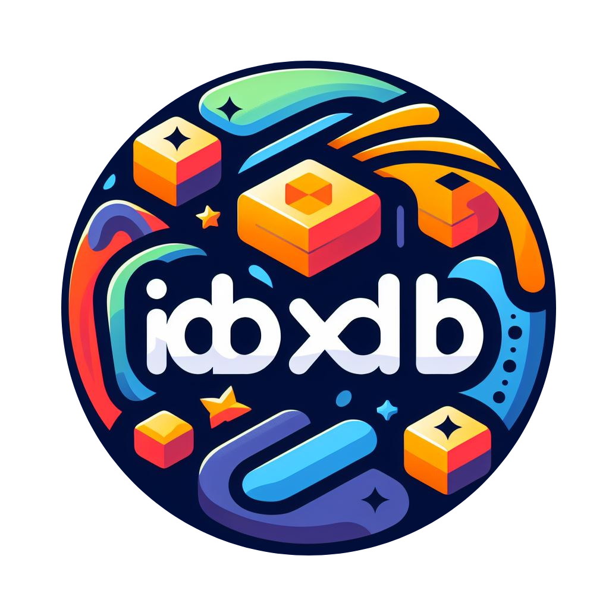

<p align="center"><a href="https://github.com/renzp94/idxdb" target="_blank" rel="noopener noreferrer"></a></p>
<p align="center">
  <a href="https://bundlephobia.com/package/@renzp/idxdb">
    
  </a>
  <a href="https://npmcharts.com/compare/@renzp/idxdb?minimal=true"></a>
  <a href="https://www.npmjs.com/package/@renzp/idxdb"></a>
  <a href="https://www.npmjs.com/package/@renzp/idxdb"></a>
    <a href="https://www.jsdocs.io/package/@renzp/idxdb"></a>
</p>

# @renzp/idxdb

一款零依赖、快速灵活、简单易用的indexedDB API库

## 安装

```sh
npm install @renzp/idxdb
```

## 使用

```ts
import { IdxDB } from '@renzp/idxdb'

const DB_NAME = "test"

await IdxDB.useDB({
  name: DB_NAME,
  version: 1,
  stores: [
    {
      name: 't_user',
      indexes: ['name', 'age'],
      keyPath: 'id',
    },
  ],
})
const db = new IdxDB(DB_NAME)
await db.connect()
await db?.store('t_user')?.getQuery({ values: {name: 'renzp94'} })
db.close()
```

更多使用方法可以查看[文档](https://idxdb.deno.dev)
